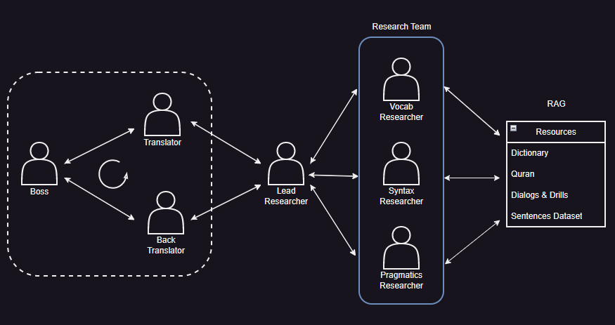

# Iterative Translation System with Nested Agent Collaboration  
  
## Overview  
This system leverages a structured, iterative approach involving multiple specialized agents to translate text from English into a target language and then back-translate to check for accuracy. The process is designed to refine translations until they closely match the original text, ensuring high fidelity.  
  
## Features  
- **Iterative Translation Process**: Translations are refined through an iterative loop where a boss agent oversees the translation and back-translation tasks.  
- **Nested Agent Collaboration**: Translators consult with a research team lead, who in turn consults individual research agents to gather necessary information based on their specializations.  
- **Specialized RAG Agents**: Each research agent can access a retrieval-augmented generation (RAG) agent tailored to their specialization area, enhancing the translation's accuracy.  
  
## Prerequisites  
- Python 3.x  
- Libraries: `autogen`, `chromadb`, `dotenv`, `os`  
- API access with valid API keys.  
  
## Installation  
Ensure Python 3 and pip are installed on your system. Install the necessary Python libraries:  
```bash  
pip install python-dotenv chromadb pyautogen  
```  
  
## Setup  
Set up your environment by storing your API keys in a .env file:  
```bash  
OPENAI_API_KEY='your_openai_api_key_here'  
ANTHROPIC_API_KEY='your_anthropic_api_key_here'  
```  
  
## Usage  
Configure the agents with the specific roles and tasks defined in the code.  
Insert appropriate keywords into variable **`source_language`**, **`target_language`**, and **`problem`** (master prompt).  
Run the script to initiate the translation task where agents collaborate to process the translation from English to the target language and back.  
Monitor and adjust the translation loop based on feedback from the back-translator and the translation validator.  
  
## How It Works  
  
**Initiation:** The **`Boss`** agent assigns a passage to the **`Translator`**.  
**Translation Development:** The **`Translator`** interacts with the **`Research Team Lead`**, who orchestrates consultations with individual research agents. Each agent can consult a specialized RAG agent to obtain necessary information for translation.  
**Translation Reporting:** Once a translation is developed, it is passed back up to the **`Research Team Lead`**, who then reports it to the **`Translator`**.  
**Back-Translation:** The **`Boss`** then assigns the translation to the **`Back-Translator`** to convert it back into the source language.  
**Validation:** (Not yet implemented) If the back-translation closely matches the original text, the process terminates. Otherwise, it repeats.  
  
## Findings  
Translations: The system has been successful in developing initial translations. However, back-translations have not yet been successfully integrated into the loop, preventing the completion of the validation step.  
  
