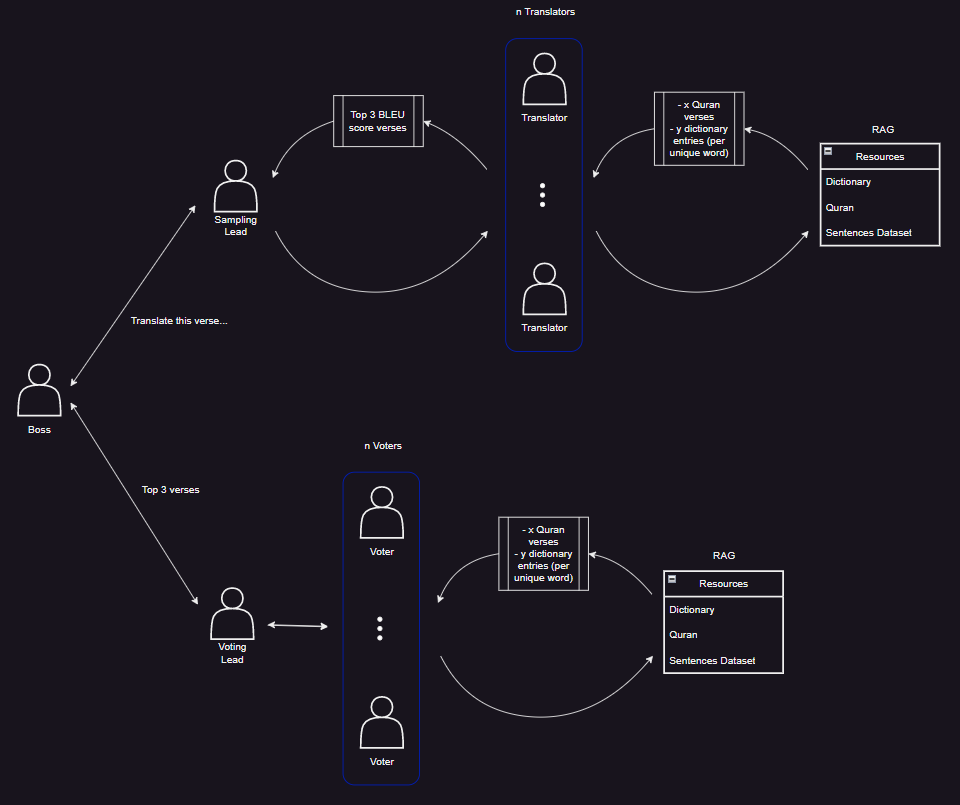

## Overview
This script facilitates a translation and voting process where n agents generate translations, and n agents vote on the best translation from the top three (based on BLEU score). Agents retrieve resources including the most relevant English & Target Language paired verses, and dictionary entries from the target language.

  

## Prerequisites
### Packages Installation
Run the following command to install the necessary packages:

```bash
pip install pyautogen chromadb sacrebleu python-Levenshtein tiktoken dotenv 
pip install markdownify vectordb anthropic pypdf 
```

## Environment Setup
Create a .env file in your project root directory.\
Add your API keys and target language to the .env file as follows:

```bash
OPENAI_API_KEY=your_openai_api_key_here
ANTHROPIC_API_KEY=your_anthropic_api_key_here
TARGET_LANGUAGE=your_target_language_here
```
**Note:** Avoid naming the target language if the language group is at risk of persecution.

## Configuration
### Variables to Set
**model:** Enable local models with lmstudio. (un)comment options as desired.
```python
config_list = [
    {
        "model": "claude-3-haiku-20240307",
        # "model": "claude-3-opus-20240229",
        "api_key": anthropic_api_key,
        "base_url": "https://api.anthropic.com",
        "api_type": "anthropic",
        "model_client_cls": "AnthropicClient",
    },
    # {
    #     'model': 'gpt-4-32k',
    #     'api_key': openai_api_key,
    # },
    # {
    #     'model': 'does not matter',
    #     'api_key': 'does not matter',
    #     'base_url': 'http://localhost:1234/v1',
    # },    
]
```
**num_agents:** Number of agents participating in translation and voting.
```python
num_agents = 20 # >= 4
```
**source_language/target_language:** Languages used throughout the script.
```python
source_language = 'English'
target_language = os.getenv('TARGET_LANGUAGE')
```
**passage range:** Define the range of verses to be translated.
```python
passages = ScriptureReference('gen 1:1', 'gen 1:31').verses
```
**resources:** Configure where to find and how to structure the resources. 
- Resource files should be placed in the dictionary folder (within the project root folder. I.e., `autogen-translator/dictionary`).
- Currently, resources are batched one line at a time (i.e., translation pairs must be contained within each line of the resource files). This is set in the `retrieve_config` arg of the retrieve agents (`librarian` and `dictionarian`):
```python
librarian = CustomRetrieveUserProxyAgent(
    name='Librarian',
    # ... other args ...
    retrieve_config={
        # ... other kwargs ...
        # 'custom_text_split_function': text_split,
        'chunk_mode': 'one_line',
    },
)
```
To apply custom rules to how the resources are chunked/split, uncomment `custom_text_split_function` kwarg, comment out `chunk_mode` kwarg, and modify the existing `text_split` function as desired.\
Declare where resource files are located here:
```python
example_files = [
    os.path.join(os.path.abspath(''), 'dictionary', 'target_training_dataset_joined.txt'),
    os.path.join(os.path.abspath(''), 'dictionary', 'quran_english_target_joined.txt'),
]
dictionary_files = [
    os.path.join(os.path.abspath(''), 'dictionary', 'target_dictionary.txt'),
]
```
The distinction is made between example files and dictionary files since there is a differently configured RAG agent assigned to each type.
**n_results:** Number of results for example resources (e.g., 30) and dictionary resources (for each unique word - e.g., 8).
```python
librarian.n_results = 60
dictionarian.n_results = 8 
```

## Deleting Cache Resources
To ensure fresh results, you might need to clear cache directories periodically:\

Delete contents of the root `__pycache__` folder.\
Delete contents of the root `tmp/db` folder.\
Delete contents of the `<root>/tmp/chromadb` folder.\